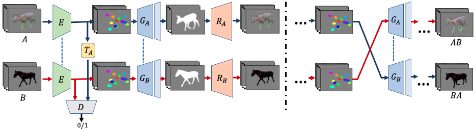

## [JOKR: Joint Keypoint Representation for Unsupervised Cross-Domain Motion Retargeting](https://arxiv.org/abs/2106.09679)

### 摘要

原视频和目标视频形状不同时，之前专注于特定对象先验的方法就会失败，作者提出联合关键点表达可以捕捉原视频和目标视频都有的动作，而且不需要物体先验或者数据采集。使用domain confusion项有利于对于两个domain的动作的一致的部分的解耦，可区分的外观和动作使得捕捉其中一个视频动作同时描绘另一个视频的风格的视频得以生成。

为处理物体有不同比例缩放或者不同方向的情形，作者应用了JOKR之间的仿射变换。这使得表达具有仿射不变性。

### 方法

目标视频使用的外观来自视频A，动作来自视频B，共$N_a$和$N_b$帧。分割图$s_{a,i},s_{b,i}$是给定的数据，或者是通过现成的图像分割网络得到。

#### 形状不变表达

使用JOKR作为瓶颈。用无监督关键点提取器E，提取K个关键点$k_{a,i}$，提取器采用U-Net的做法，提取热力图$h_{a,i}$（a代表视频，i代表帧序号）来确定关键点位置。

为做到几何和外观的解耦，生成过程有两步：

1. 给定$h_{a,i}$，生成器$G_{A}$被训练来输出一个同时对应提取到的关键点和物体形状的剪影。为减少参数数量，$G_{A},G_{B}$共用权重，除了最后一层。类似的，E也被用于两个视频。给定帧$a_i,b_j$，生成的剪影要最小化这个MSE loss。

$$
\mathcal{L}_{seg}=\sum_{i=0}^{N_A-1}||G_A(E(a_i))-s_{a,i}||_2+\sum_{j=0}^{N_B-1}||G_B(E(b_i))-s_{b,j}||_2
$$

训练生成器$R_A,R_B$来转换得到的分割图到原图上，因此添加了纹理。重建和感知损失为：
$$
\begin{gathered}
\mathcal{L}_{L 1}=\sum_{i=0}^{N_{A}-1}\left\|R_{A}\left(G_{A}\left(E\left(a_{i}\right)\right)\right)-a_{i}\right\|_{1}+\sum_{j=0}^{N_{B}-1}\left\|R_{A}\left(G_{B}\left(E\left(b_{j}\right)\right)\right)-b_{j}\right\|_{1} \\
\mathcal{L}_{\text {LPIPS }}=\sum_{i=0}^{N_{A}-1}\left\|\mathcal{F}\left(R_{A}\left(G_{A}\left(E\left(a_{i}\right)\right)\right)\right)-\mathcal{F}\left(a_{i}\right)\right\|_{2}+\sum_{j=0}^{N_{B}-1}\left\|\mathcal{F}\left(R_{A}\left(G_{B}\left(E\left(b_{j}\right)\right)\right)\right)-\mathcal{F}\left(b_{j}\right)\right\|_{2}
\end{gathered}
$$
$\mathcal{F}$是特征提取器。

#### 共享表达

AB视频描绘的物体可能来自不同domain，所以提取的关键点对于各自的视频可能有不同的语义信息。因此作者强制编码的关键点来自共享的分布，从而鼓励关键点捕捉同时来自两个视频的动作。AB的特定风格在生成器的权重里编码。为施加共享的分布，作者使用domain confusion loss。

此外还用一个判别器来区分A和B的domain的关键点，编码器被训练来欺骗他。
$$
\mathcal{L}_{\mathrm{DC}}=\sum_{i=0}^{N_{A}-1} \ell_{\text {bce }}\left(D\left(k_{a, i}\right), 1\right)+\sum_{j=0}^{N_{B}-1} \ell_{\text {bce }}\left(D\left(k_{b, j}\right), 1\right)
$$
$\ell_{bce}=-(q\log(p)+(1-q)\log(1-p))$是二元交叉熵损失函数。

关键点提取器尝试使得关键点分布无法区分，同时判别器做对抗它的训练：
$$
\mathcal{L}_{\mathrm{D}}=\sum_{i=0}^{N_{A}-1} \ell_{\text {bce }}\left(D\left(k_{a, i}\right), 0\right)+\sum_{j=0}^{N_{B}-1} \ell_{\text {bce }}\left(D\left(k_{b, j}\right), 1\right)
$$

#### 时间连贯性

为保证生成的视频是时间连贯的，即生成的动作平滑无抖动。应用时间正则化在生成的关键点上，最小化相邻帧之间的关键点的距离。
$$
\mathcal{L}_{\mathrm{tmp}}=\sum_{i=0}^{N_{A}-1}\left\|k_{a, i}-k_{a, i+1}\right\|_{2}+\sum_{j=0}^{N_{B}-1}\left\|k_{b, j}-k_{b, j+1}\right\|_{2}
$$
因为物体有大动作的时候关键点的含义可能会变化（比如由后腿变成尾巴），所以作者应用随机仿射变换，比较变换后的关键点和变换后的图像提取出的关键点，来保证生成的关键点对任意仿射变换是等变的（equivariant）。即保证了每个关键点语义的一致性，对于一个仿射变换T，等变loss的公式是：
$$
\mathcal{L}_{\mathrm{eq}}=\sum_{i=0}^{N_{A}-1}\left\|T\left(E\left(a_{i}\right)\right)-E\left(T\left(a_{i}\right)\right)\right\|_{1}+\sum_{j=0}^{N_{B}-1}\left\|T\left(E\left(b_{j}\right)\right)-E\left(T\left(b_{j}\right)\right)\right\|_{1}
$$

#### 关键点正则化

关键点们可能会缩成一个点，因此有额外的两个损失项。

首先惩罚两个过近的关键点：
$$
\mathcal{L}_{\mathrm{sep}}=\frac{1}{K^{2}} \sum_{\ell=0}^{K-1} \sum_{\ell \neq r}\left(\sum_{i=0}^{N_{A}-1} \max \left(0, \delta-\left\|k_{a, i}^{\ell}-k_{a, i}^{r}\right\|^{2}\right)+\sum_{j=0}^{N_{B}-1} \max \left(0, \delta-\left\|k_{b, j}^{\ell}-k_{b, j}^{r}\right\|^{2}\right)\right)
$$
然后用剪影的损失鼓励关键点待在物体上：
$$
\mathcal{L}_{\mathrm{sill}}=\frac{1}{K} \sum_{\ell=0}^{K-1}\left(\sum_{i=0}^{N_{A}-1}-\log \sum_{u, v} s_{a, i}(u, v) H_{a, i}^{\ell}(u, v)+\sum_{j=0}^{N_{B}-1}-\log \sum_{u, v} s_{b, j}(u, v) H_{b, j}^{\ell}(u, v)\right)
$$

#### 两步优化

大部分损失和形状有关，和纹理无关，所以可以用两步优化目标函数。首先用$\mathcal{L}_D$训练判别器，同时训练E，$G_A,G_B$。第二步训练$R_A,R_B$。

#### 增强

数据有限时可能导致mode collapse。所以作者用随机仿射变换进行增强。因为保留背景是必要的，而这些增强可能会给生成的帧带来伪影（artifact）,所以这些增强直接作用在关键点上，在其传给判别器之前。

### 预测

得到E,T,G,R之后，用下面的公式得到结果：
$$
a b_{j}=R_{A}\left(G_{A}\left(T\left(E\left(b_{j}\right)\right)\right)\right)
$$
即有a的外观b的动作的第j帧。
