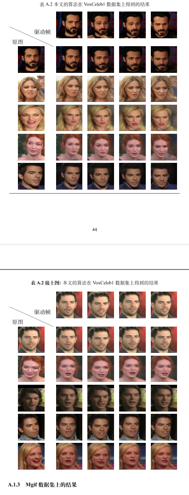

使用latex写文章，尤其是和图像相关的文章时，常常会遇到需要用图片表格的情况。为了能够跨页，我们可以使用`longtable`。因为图片较大，如果没有刻意缩小，那么表格就会跨页。有的文章接收方会要求跨页表格在第二页顶部增加额外的题注来接上上一页的表格，以及第一个题注在表格顶部。

## 跨页题注

https://tex.stackexchange.com/questions/115195/table-captions-continued 给出了一个解决方法。

> The package `longtable` allows you to define
>
> 1. a header for the first page by `\endfirsthead`
> 2. a header for all next pages by `\endhead`
> 3. a footer fo all pages expect the last one by `\endfoot`
> 4. a footer for the last page by `\endlastfoot`.

这段里的这几个command可以用于控制跨页表格的题注的内容。举例来说，如果我需要在长表格前有个题注，跨页时第二面的表格顶部也有题注，可以这么写：

```latex
\begin{longtable}{ccc}
\caption {Some Members of the Suggested Estimator}\label{Tab:1}\\
\endfirsthead
\caption* {\textbf{Table \ref{Tab:1} Continued:} Blablabla}\\
\endhead
\endfoot
\endlastfoot
%任意内容
\end{longtable}
```

完整代码：

```latex
\begin{longtable}{ccccc}
\caption {本文的算法在VoxCeleb1数据集上得到的结果}\label{fig:result3}\\
\endfirsthead
\caption* {\textbf{表 \ref{fig:result3} 接上图:} 本文的算法在VoxCeleb1数据集上得到的结果}\\
\endhead
\endfoot
\endlastfoot


\diagbox{原图}{驱动帧} &
\includegraphics[width=20mm]{image/appendix1/table/vox/1/gaussian-0-1.png} &
\includegraphics[width=20mm]{image/appendix1/table/vox/1/gaussian-0-2.png} &
\includegraphics[width=20mm]{image/appendix1/table/vox/1/gaussian-0-3.png} &
\includegraphics[width=20mm]{image/appendix1/table/vox/1/gaussian-0-4.png} \\
\includegraphics[width=20mm]{image/appendix1/table/vox/1/gaussian-1-0.png} &
\includegraphics[width=20mm]{image/appendix1/table/vox/1/gaussian-1-1.png} &
\includegraphics[width=20mm]{image/appendix1/table/vox/1/gaussian-1-2.png} &
\includegraphics[width=20mm]{image/appendix1/table/vox/1/gaussian-1-3.png} &
\includegraphics[width=20mm]{image/appendix1/table/vox/1/gaussian-1-4.png} \\
\includegraphics[width=20mm]{image/appendix1/table/vox/1/gaussian-2-0.png} &
\includegraphics[width=20mm]{image/appendix1/table/vox/1/gaussian-2-1.png} &
\includegraphics[width=20mm]{image/appendix1/table/vox/1/gaussian-2-2.png} &
\includegraphics[width=20mm]{image/appendix1/table/vox/1/gaussian-2-3.png} &
\includegraphics[width=20mm]{image/appendix1/table/vox/1/gaussian-2-4.png} \\
\includegraphics[width=20mm]{image/appendix1/table/vox/1/gaussian-3-0.png} &
\includegraphics[width=20mm]{image/appendix1/table/vox/1/gaussian-3-1.png} &
\includegraphics[width=20mm]{image/appendix1/table/vox/1/gaussian-3-2.png} &
\includegraphics[width=20mm]{image/appendix1/table/vox/1/gaussian-3-3.png} &
\includegraphics[width=20mm]{image/appendix1/table/vox/1/gaussian-3-4.png} \\
\includegraphics[width=20mm]{image/appendix1/table/vox/1/gaussian-4-0.png} &
\includegraphics[width=20mm]{image/appendix1/table/vox/1/gaussian-4-1.png} &
\includegraphics[width=20mm]{image/appendix1/table/vox/1/gaussian-4-2.png} &
\includegraphics[width=20mm]{image/appendix1/table/vox/1/gaussian-4-3.png} &
\includegraphics[width=20mm]{image/appendix1/table/vox/1/gaussian-4-4.png} \\
\includegraphics[width=20mm]{image/appendix1/table/vox/1/gaussian-5-0.png} &
\includegraphics[width=20mm]{image/appendix1/table/vox/1/gaussian-5-1.png} &
\includegraphics[width=20mm]{image/appendix1/table/vox/1/gaussian-5-2.png} &
\includegraphics[width=20mm]{image/appendix1/table/vox/1/gaussian-5-3.png} &
\includegraphics[width=20mm]{image/appendix1/table/vox/1/gaussian-5-4.png} \\

\midrule

\diagbox{原图}{驱动帧} &
\includegraphics[width=20mm]{image/appendix1/table/vox/2/gaussian-0-1.png} &
\includegraphics[width=20mm]{image/appendix1/table/vox/2/gaussian-0-2.png} &
\includegraphics[width=20mm]{image/appendix1/table/vox/2/gaussian-0-3.png} &
\includegraphics[width=20mm]{image/appendix1/table/vox/2/gaussian-0-4.png} \\
\includegraphics[width=20mm]{image/appendix1/table/vox/2/gaussian-1-0.png} &
\includegraphics[width=20mm]{image/appendix1/table/vox/2/gaussian-1-1.png} &
\includegraphics[width=20mm]{image/appendix1/table/vox/2/gaussian-1-2.png} &
\includegraphics[width=20mm]{image/appendix1/table/vox/2/gaussian-1-3.png} &
\includegraphics[width=20mm]{image/appendix1/table/vox/2/gaussian-1-4.png} \\
\includegraphics[width=20mm]{image/appendix1/table/vox/2/gaussian-2-0.png} &
\includegraphics[width=20mm]{image/appendix1/table/vox/2/gaussian-2-1.png} &
\includegraphics[width=20mm]{image/appendix1/table/vox/2/gaussian-2-2.png} &
\includegraphics[width=20mm]{image/appendix1/table/vox/2/gaussian-2-3.png} &
\includegraphics[width=20mm]{image/appendix1/table/vox/2/gaussian-2-4.png} \\
\includegraphics[width=20mm]{image/appendix1/table/vox/2/gaussian-3-0.png} &
\includegraphics[width=20mm]{image/appendix1/table/vox/2/gaussian-3-1.png} &
\includegraphics[width=20mm]{image/appendix1/table/vox/2/gaussian-3-2.png} &
\includegraphics[width=20mm]{image/appendix1/table/vox/2/gaussian-3-3.png} &
\includegraphics[width=20mm]{image/appendix1/table/vox/2/gaussian-3-4.png} \\
\includegraphics[width=20mm]{image/appendix1/table/vox/2/gaussian-4-0.png} &
\includegraphics[width=20mm]{image/appendix1/table/vox/2/gaussian-4-1.png} &
\includegraphics[width=20mm]{image/appendix1/table/vox/2/gaussian-4-2.png} &
\includegraphics[width=20mm]{image/appendix1/table/vox/2/gaussian-4-3.png} &
\includegraphics[width=20mm]{image/appendix1/table/vox/2/gaussian-4-4.png} \\
\includegraphics[width=20mm]{image/appendix1/table/vox/2/gaussian-5-0.png} &
\includegraphics[width=20mm]{image/appendix1/table/vox/2/gaussian-5-1.png} &
\includegraphics[width=20mm]{image/appendix1/table/vox/2/gaussian-5-2.png} &
\includegraphics[width=20mm]{image/appendix1/table/vox/2/gaussian-5-3.png} &
\includegraphics[width=20mm]{image/appendix1/table/vox/2/gaussian-5-4.png} \\
\end{longtable}

```

也就是说，把想放的内容放在end开头的这几个command之前就可以。上面的代码可以得到下面这个效果：



如果要增加跨页每个表格顶部的横杠，可在`\endfirsthead`前面加，比如：

```tex
\begin{longtable}{ccc}
\caption {Some Members of the Suggested Estimator}\label{Tab:1}\\\toprule
\endfirsthead
\caption* {\textbf{Table \ref{Tab:1} Continued:} Blablabla}\\
\endhead
\endfoot
\bottomrule
\endlastfoot
%任意内容
\end{longtable}
```

